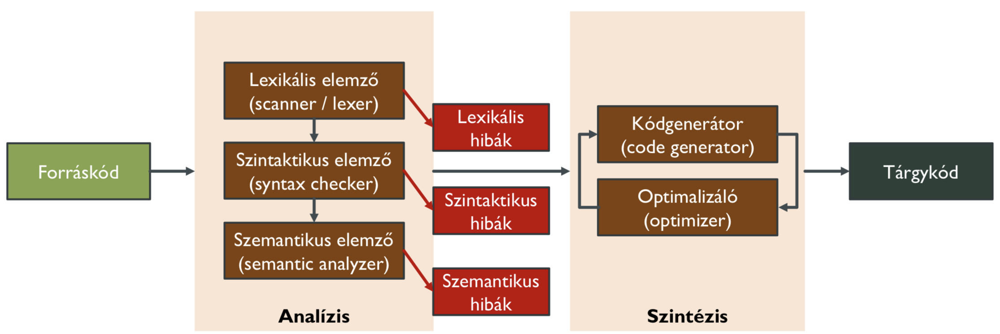

# Tartalomjegyzék
## Formális nyelvek  
- [1. Előadás](#part-1)
- [2.Előadás](#part-2)
- [3.Előadás](#part-3)
- 4.Előadás
- 5.Előadás
- 6.Előadás
## Fordítóprogramok
- [7. Előadás](#part-7)
- [8.Előadás](#part-8)
- 9.Előadás
- 10.Előadás
- 11.Előadás
- 12.Előadás
# Part 1  
## Alapfogalmak  
**Ábécé:** A jelek egy nem üres véges halmaza. **Jele:** V  
**Betű:** Az ábécé elemeit betűnek hívjuk.   
**Szó:** A *V* ábécé elemeinek egy tetszőleges véges sorozatát a *V* abácéc feletti szónak nevezzük. - Ha *V* nem lényeges vagy egyértelmű, akkor szóról beszélünk.  
Ha *u* egy tetszőleges szó, akkor *l(u)* jelöli a szó hosszát. 0 <= *l(u)* <= ∞, illetve *l(ε)* = 0, ahol *ε* az üres szó.  
A *V* ábécé feletti szavak halmaza: *V**  
A *V* abácé feletti nem üres szavak halmaza: *V+*  
**Nyelv:** *V** valamely részhalmazát a *V* ábécé feletti nyelvnek nevezzük. **Jele:** L  
**Nyelvosztály:** Nyelvek valamely összességét nyelvozstálynak hívjuk.  
## Műveletek szavakon  
**Konkatenáció:**   
u = t1..tk és v = q1..qm szavak *V** felett értelmezve: uv = t1..tkq1..qm  
- *V** zárt a konkatenációra és konkatenációra nézve egységelemes félcsoportot alkot.  
- Asszociatív  
- Egységelem: ε - üres szó -> εv = v = vε  

**Szó hatványa:**  
Legyen *u* egy tetszőleges szó.  
Nemnegatív egést hatványai:  

- u0 = ε
- u1 = u
- un = un-1, ahol n >= 1  

**Szó megfordítása:**  
Ha *u* egy tetszőleges szó u = t1..tk és v = tk..t1, akkor *v* az *u* megfordítottja, azaz tükörképe. **Jelölés:** u-1 = v  
**Részszó:**  
A *v* *u*-nak részszava, ha léteznek olyan w1,w2 szavak, hogy *u* = w1vw2  
**Szó prefixe:**  
A *v* az *u* szónak prefixe, ha van olyan *w* szó, hogy u = vw.  
Valódi prefix, ha v != ε és v != u.  
**Szó suffixe:**  
A *v* az *u* szó suffixe, ha van olyan szó, hogy u = wv.  
Valódi suffix, ha v != ε és v != u.  
## Műveletek nyelveken  
**Két nyelv uniója**: Legyenek L1 és L2 nyelvek V* felettiek. Ekkor az L1 és L2 nyelvek unióján az L1 U L2 := {u ∈ V* | u ∈ L1 vagy u ∈ L2 } nyelvet értjük.
  - Az unió kommutatív, asszociatív és egységelemes művelet. Az egységelem az üres nyelv (üres halmaz). Jele: Ø. Ø U L = L = L U Ø

**Két nyelv metszete**: Legyenek L1 és L2 nyelvek V* felettiek. Ekkor az L1 és L2 nyelvek metszetén az L1 ∩ L2 := {u ∈ V* | u ∈ L1 és u ∈ L2 } nyelvet értjük.

**Nyelv komplementere**: Az L ⊆ V* nyelv komplementere a V ábécére vonatkozóan: 
  - L := V* \ L, azaz minden olyan szó, ami nem tartozik az L nyelvbe.
  - L ∩ L = Ø és L U L = V*

**Nyelv tükörképe**: Az L ⊆ V* nyelv tükörképe az a nyelv, amely a szavainak megfordítottját tartalmazza. Jele: L-1. L-1 := {u ∈ V* | u-1 ∈ L}

**Két nyelv konkatenációja**: Legyenek L1 és L2 nyelvek. Ekkor az L1 és L2 nyelvek konkatenációján az L1L2 := {uv | u ∈ L1 és v ∈ L2 } nyelvet értjük.
  - A nyelvek halmaza a konkatenációra nézve egység elemes félcsoport alkot. Egység elem: {ε} (az üres szót tartalmazó nyelv). {ε}L = L = L{ε}. ∅L = ∅ = L∅

**Nyelv hatványa**: Legyen L egy tetszőleges nyelv. Nemnegatív egész hatványai:
  - L0 := {ε}
  - L1 := L
  - Ln := Ln-1L , ahol n≥1.

**Nyelv lezártja (iteráltja)**: Legyen L egy tetszőleges nyelv.
  - L* := L0 U L1 U L2 U … az L nyelv lezártja. Másképpen: L* := ∪ Li valamint L+ = ∪ Li (i≥0 i≥1)  

Az alábbi három művelet reguláris: **unió**, **konkatenáció**, **lezárás**.

## Nyelvek Megadási Módjai
- Logikai formulával
- Strukturális rekurzióval
- Algoritmussal
- Matematikai gépekkel
- Produkciós rendszerekkel (Szabályokkal)  

## Nyelv megadása szabályrendszerrel
### Emlékeztető:  
- **V** - ábécé, jelek nem üres véges halmaza;
- **V*** - az adott jelkészlet felett értelmezett összes szó;
- **L** ⊆ **V*** - formális nyelv, szavak halmaza.  

**Definíció:** Grammatikának (nyelvtannak) a következő négyest nevezzük:  
**G = (N, T, P, S)**
- **N** a nemterminális ábécé,
- **T** a terminálisok ábécéje,
- **P** az átírási szabályok véges halmaza,
- **S** a kezdőszimbólum.

#### Grammatika: G = (N, T, P, S)
- **N** és **T** diszjunkt halmazok, azaz N∩T = ∅.
- **S** ∈ **N**, kezdőszimbólum.
- A szabályok **p → q** alakúak, ahol **p** ∈ (N ∪ T)*N(N ∪ T)*, **q** ∈ (N ∪ T)*, és **p** jelöli a szabály baloldalát, **q** a jobboldalát, → a két oldalt elválasztó jel.
- A szabályok baloldala kötelezően tartalmaz legalább egy nemterminális szimbólumot.
- (N ∪ T)* elemeit mondatformáknak nevezzük.

### Grammatika által generált nyelv
Minden olyan szó, amely közvetetten levezethető a kezdőszimbólumból.  

### Közvetlen levezetés  
Legyen **G = (N, T, P, S)** egy adott grammatika.  
Legyen **u, v ∈ (N ∪ T)***.  
Azt mondjuk, hogy a **v** mondatforma közvetlenül levezethető az **u** mondatformából, ha létezik **u₁, u₂ ∈ (N ∪ T)*** és **x → y ∈ P** úgy, hogy **u = u₁xu₂** és **v = u₁yu₂**.  
**Jelölése:** u → 𝑮 v

### Közvetett levezetés
Legyen **G = (N, T, P, S)** egy adott grammatika.  
Legyen **u, v ∈ (N ∪ T)***.  
Azt mondjuk, hogy a **v** mondatforma közvetetten levezethető az **u** mondatformából, ha létezik olyan **k ≥ 0** szám és **x₀, ..., xₖ ∈ (N ∪ T)***, hogy **u = x₀** és **v = xₖ** és ∀ **i ∈ [0, k-1]**: **xᵢ → 𝑮 xᵢ₊₁**.  
**Jelölése:** u →* 𝑮 v

### Ekvivalencia
A **G₁** és **G₂** nyelvtanok ekvivalensek, ha **L(G₁) = L(G₂)**, azaz ugyanazt a nyelvet generálják.  
Gyengén ekvivalensek, ha **L(G₁) \ {ε} = L(G₂) \ {ε}**.

# Part 2  
## Chomsky-féle grammatika típusok

**Definició:** A **G = (N, T, P, S)** grammatika **i**-típusú (**i = 0, 1, 2, 3**), ha **P** szabályhalmazára teljesülnek a következők:
- **i = 0:** Nincs korlátozás.
- **i = 1:** P minden szabálya **u₁Au₂ → u₁vu₂** alakú, ahol **u₁, u₂, v ∈ (N ∪ T)***, **A ∈ N**, és **v ≠ ε**, kivéve az **S → ε** alakú szabályt, de ekkor **S** nem fordul elő egyetlen szabály jobboldalán sem (röviden: KES).
- **i = 2:** P minden szabálya **A → v** alakú, ahol **A ∈ N**, **v ∈ (N ∪ T)***.
- **i = 3:** P minden szabálya vagy **A → uB** vagy **A → u** alakú, ahol **A, B ∈ N** és **u ∈ T***.

### Chomsky-féle hierarchia
Egy *L* nyelvet i-típusúnak nevezünk, ha létezik olyan i-típusú grammatika, ami az *L* nyelvet generálja.  

**L₃ ⊆ L₂ ⊆ L₁ ⊆ L₀**  
Pontosabban valódi tartalmazás van  

**L₃ ⊆ L₂ ⊆ L₁ ⊆ L₀**

Azonban

**G₃ ⊆ G₂ !⊆ G₁ ⊆ G₀**

Ha a 2-es típusú szabályoknál is kikötnénk, hogy **v ≠ ε**, akkor igaz lenne a tartalmazás, és akkor triviálisan igaz lenne a nyelvcsaládokra is tartalmazás.

## Chomsky-féle grammatika típusok részletesebben

| Típus | Alaptípus szabályai | Speciális alakok szabályai | Normál forma szabályai |
|-------|----------------------|---------------------------|------------------------|
| 0     | Nincs korlátozás. |p → q, ahol p ∈ N+, q ∈ (N ∪ T)* |
| 1     | u₁Au₂ → u₁vu₂, ahol u₁, u₂, v ∈ (N ∪ T)*, A ∈ N, és v ≠ ε, kivéve az S → ε, de ekkor S nem fordul elő egyetlen szabály jobboldalán sem. (környezetfüggő grammatika) | p → q, ahol l(p) ≤ l(q) kivéve az S → ε, de ekkor S nem fordul elő egyetlen szabály jobboldalán sem. (hosszúság nemcsökkentő grammatika) | Kuroda normál forma: A → a vagy A → B vagy A → BC vagy AB → CD alakúak a szabályok, ahol a ∈ T és A, B, C, D ∈ N, kivéve az S → ε, ahol S nem fordul elő egyetlen szabály jobboldalán sem. |
| 2     | A → v, ahol A ∈ N és v ∈ (N ∪ T)*, (általános) | A → v, ahol v ∈ (N ∪T)*, A ∈ N és v≠ε, kivéve az S → ε, de ekkor S nem fordul elő egyetlen szabály jobboldalán sem. | Chomsky normál forma A → a vagy A → BC alakúak a szabályok, ahol a ∈ T és A,B, C ∈ N, kivéve az S → ε, de ekkor S nem fordul elő egyetlen szabály jobboldalán sem. |
| 3     | A → uB vagy A → u, ahol A, B ∈ N és u ∈ T* (reguláris) | A → aB vagy A → a, ahol a ∈ T, és A,B ∈ N, kivéve az S → ε, de ekkor S nem fordul elő egyetlen szabály jobboldalán sem. | 3-as normál forma A → aB vagy A → ε, ahol a ∈ T, és A,B ∈ N. |

## Nyelvtani transzformáció

A nyelvtani transzformáció olyan eljárás, amely egy **G** grammatikából egy másik **G'** grammatikát készít.  
Ekvivalens transzformációról beszélünk, ha minden **G** grammatikára és az ő **G'** transzformáltjára igaz, hogy **L(G) = L(G')**.

## ε-mentesítés

### Tétel:
Minden **G = (N, T, P, S)** környezetfüggetlen (2-es típusú) grammatikához megkonstruálható egy vele ekvivalens **G' = (N', T, P', S')** környezetfüggetlen grammatika úgy, hogy **P'**-ben nincs **A → ε** alakú szabály, kivéve, ha **ε ∈ L(G)**, mert akkor **S' → ε ∈ P'**, de ekkor **S'** nem szerepelhet szabály jobboldalán.

### ε-mentesítés lépései

#### Első lépés:
Meghatározzuk, hogy mely nemterminálisokból vezethető le az üres szó.
- **H := { A ∈ N | A →* 𝑮 ε }**
- Ehhez definiáljuk a **Hᵢ** (**i ≥ 1**) halmazokat:
  - **H₁ := { A ∈ N | ∃ A → ε ∈ P }**
  - **Hᵢ₊₁ := Hᵢ ∪ { A ∈ N | ∃ A → w ∈ P és w ∈ Hᵢ* }**
  - **H₁ ⊆ H₂ ⊆ ... ⊆ Hₖ = Hₖ₊₁ ∃ k** és legyen **H := Hₖ**.

Látható, hogy **ha A ∈ N és A →* 𝑮 ε**, akkor és csak akkor, ha **A ∈ H**.  
Ennek következménye, hogy **ε ∈ L(G)**, akkor és csak akkor, ha **S ∈ H**.

#### Második lépés:
Átalakítjuk **H** ismeretében a grammatika szabályait a kellő alakúra.
- **S ∉ H** esetén:
  - **A → v' ∈ P'**, akkor, és csak akkor, ha **v' ≠ ε** és **∃ A → v ∈ P** úgy, hogy **v'**-t **v**-ből úgy kapjuk, hogy elhagyunk nulla vagy több **H**-beli nemterminálist **v**-ből.

- **S ∈ H** esetén:
  - A korábbi szabályokhoz hozzá vesszük még a következő két szabályt:
    - **S' → ε**
    - **S' → S**
    - ahol **S' ∉ N** a **G'** grammatika új kezdőszimbóluma.

### Megjegyzés:
Az átalakítás megőrzi a 2. és 3. típust.

# Part 3  

# Part 7
## Fordítóprogramok célja és felépítése
Magas színtű programozási nyelv -> **Fordítóprogram** -> Gépi kód  

### Magas színtű programozási nyelv vs Gépi kód

| Magas szintű programozási nyelv | Gépi kód |
| ----------- | ----------- |
| Platform-független | Erősen platformfüggő |
| Könnyebb programozni | Gépküzeli (numerikus utasításkódok, regiszterek) |
| Közelebb a megoldandó problémához | Optimalizált |  

### Fordítás vs Értelmezés

| Fordítás | Értelmezés |
| ----------- | ----------- |
| Gyorsabb végrehajtás | Jellemzően jelentősen lassabb végrehajtás |
| Elkülönül a fordítási és futási idő | Csak futási idő |
| Minden platformra külön-külön fordítani kell | Minden platformon azonnal futtatható (ha van interpreter telepítve) | 
| A forrás alaposabb ellenőrzése | Rugalmasabb (pl: utasítások fordítási időben történő összeállítása) |
| A tárgykód optimalizálása |  | 
| C, C++, Haskell, Ada, .. | Python, Perl, php, JavaScript, .. | 

### Fordítás végrehajtás közben (JIT)
- **Probléme:** Az értelmezés lassabb a gépi kód végrehajtásánál, ez igaz a bájtkód értelmezésére is
- **Ötlet:** A bájtkód fordítása gépi kódra futási idpőben
- Teljes fordítás a végrahajtás kezdetén: túl nagy kezdeti lassulás
- **Megoldás:**
    -  Kezdetben értelmezés
    - Statisztikák gyűjtése a leggyakrabban lefutó kódrészletekről
    - Ezek fordítása gépi kódra
    - A következő alkalommal a lefordított kódrészlet fut az értelmezés helyett
- A JIT fordító futási időben gyüjtőtt információkat is figyelembe vehet a kódoptimalizálásnál. Ilyenekhez klasszikus fordítóprogram nem fér hozzá.
- A bájtkód végrehajtása jellemzően még így is lassabb a gépi kódhoz képest, de ez speciális alkalmazási területeket leszámítva nem baj.

### Fordítóprogramok fejlődése  
- 1957 - Első Fortran compiler (18 emberévnyi munka)
- Azóta fejlődött a formális nyelvek és autómaták elmélete
- Ma a fordítóprogramok létrehozásának egy része automatizálható elemzőgenerátorokkal
    - A programszöveg elemi részekre bontása
    - A programszöveg formai helyességének vizsgálata
- További ellenőrzések és a kódgenerálás nem automatizálható
    - Implementációt keretrendszerek segíthetik
- Kódoptimalizálás komoly kihívás

### Fordítóprogramok logikai felépítése  

        
- **Lexikális elemző:** 
    - Feladat: A forrásszöveg elemi egységekre tagolása
    - Bemenet: Karaktersorozat
    - Kimenet: Lexikális elemek sorozata + lexikális hibák
    - Eszközök: Reguláris kifejezések, véges determinisztikus automaták

# Part 8
## Lexikális elemző
**Feladat:** A forrásszöveg elemi egységekre tagolása  
**Bemenet:** Karaktersorozat  
**Kimenet:** Lexikális elemek sorozata + lexikális hibák  
**Eszközök:** Reguláris kifejezések, véges determinisztikus automaták  

**Szóközök, tabok, újsorok nem alkotnak tokeneket**
  - Más tokenek elválasztására valók
  - Lexikális elemző felismeri ezeket
  - Nem továbbítja szintaktikus elemző felé  

**Leghosszabb illeszkedés elve:** A leghosszabban illeszkedő karaktersorozatokból képzünk tokent.  
**Prioritás elve:** Ha a leghosszabban illeszkedő karaktersorozat több reguláris kifejezésre is illeszkedik, a sorrendben korábban álló nyer.  
### Lexikális elemző létrehozása
**Nyelv definiálása:** Tokendefiníciók reguláris kifejezésekkel.  
**Fordítóprogram implementációja:** Lexikáliselemzőgenerátor vagy programozó.  
**A fordítóprogram működése:** Karaktersorozat a forrásfájlból -> Lexikális elemző -> Tokensorozat vagy lexikális hiba.  

### Tokenekhez csatolt információk
- Felismert tokenekhez kiegésztő információkat csatol a lexikális elemző.
- **Minden tokenhez:** Pozíció (első karakter sor, oszlop + utolsó karakter sor, oszlop) -> Hibaüzenetekhez, refaktoráláshoz
- **Azonosítókhoz:** Azonosító szövege -> szemantikus elemzéshez
- **Literálokhoz:** Literál értéke -> kódgeneráláshoz, kódoptimalizációhoz

### Lexikális hibák
- Lexikális hiba esetén hibajelzést ad a fordító, és folytatja az elemzést
- **Illegális karakter:** Nyelv ábécéjében nem definiált karakterek -> Az addig felépített token kiadása, ha volt illeszkedés -> Illegális karakter követő karakterrel folytatódik az elemzés
- **Lezáratlan String:** Sor végén derül ki -> Következő sorban folytatódik az elemzés
- **Lezáratlan több soros megjegyzés:** Fájl végén derül ki -> Nincsen további elemzés

# Part 9 
 

