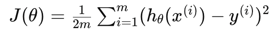

# Szoftver mélyneuronhálók vizsga tételek
## Tartalomjegyzék
- [1. Tétel](#1tétel)  
 Mi a gépi tanulás? Milyen feladatok megoldására ideális? Felügyelt és felügyeletlen tanulás feladatai, formális definíciója és folyamatának lépései. Hipotézisfüggvény és költségfüggvény fogalma, példák. Optimalizáció és tárgya, gradiens módszer, update-szabály, tanulási ráta, garanciák a megtalált megoldásra, feature scaling.
- [2. Tétel](#2tétel)   
Regresszió és klasszifikáció feladata, különbségek. Egy- és többváltozós lineáris regresszió: hipotézisfüggvény, költségfüggvény, megoldás gradiens módszerrel, alkalmazásai.
- [3. Tétel](#3tétel)   
- [4. Tétel](#4tétel)   
Alultanulás és túltanulás jellemzői, felismerésük. Hiperparaméterek, példák. A modell betanításának és kiértékelésének lépései validációs halmazzal. A túltanulás kezelése (mintaelemek/paraméterek száma, early stopping, adataugmentáció, zaj, dropout).
- [5. Tétel](#5tétel)  
Mesterséges neuron modell. Teljesen összekötött rétegek és a Multilayer Perceptron (MLP) modell felépítése, paraméterei, hipotézisfüggvénye, aktivációs függvények, költségfüggvények, skalár és vektor alakú címke, regresszió, bináris- és multi-class klasszifikáció esetén (log. loss, CE képlete nem kell fejből).
- [6. Tétel](#6tétel)  
Számítási gráfok és a backpropagation algoritmus. Backpropagation példa feladat megoldása papíron.
- [7. Tétel](#7tétel)  
Az MLP modell gyengesége képfeldolgozásban. Diszkrét konvolúció és konvolúciós réteg, pooling réteg hipotézisfüggvények. Konvolúciós háló felépítése (LeNet-5 architektúra) és működésének lényege, hierarchikus mintázatfelismerés, transzláció (eltolás) invariancia. Padding, stride (lépésköz) fogalma.
- [8. Tétel](#8tétel)  
Transfer learning és lépései (mérlegelendő szempontok a háló átalakításánál, finomhangolásánál). Súlyok befagyasztása. Mélyhálók és problémáik: a gradiens skálázódása. Az instabil gradiens probléma és elkerülése: batch normalization és reziduális hálók.
- [9. Tétel](#9tétel)  
Felügyeletlen tanulás neuronhálóval. Az autoencoder felépítése. Az autoencoder megszorítás jelentősége és két tanult fajtája. Az autoencoder alkalmazása: tömörítés, zajszűrés, transfer learning.

## 1.Tétel

### Mi a gépi tanulás?
A gépi tanulás egy olyan számítástechnikai tudományterület, amely algoritmusokat és statisztikai modelleket alkalmaz arra, hogy a számítógépek automatikusan tanuljanak és javuljanak tapasztalatokból anélkül, hogy kifejezetten beprogramoznák őket. A cél az, hogy a gép felismerje a mintákat az adatokban, és ezen minták alapján előrejelzéseket vagy döntéseket hozzon.

### Milyen feladatok megoldására ideális?
A gépi tanulás számos különböző feladat megoldására alkalmas, például:
- **Kép- és hangfelismerés:** Az arcok, tárgyak, beszéd azonosítása.
- **Természetes nyelv feldolgozás (NLP):** Szövegértés, fordítás, érzelemfelismerés.
- **Ajánlórendszerek:** Filmek, termékek ajánlása a felhasználók korábbi viselkedése alapján.
- **Orvosi diagnosztika:** Betegségek felismerése és diagnosztizálása orvosi adatok alapján.
- **Pénzügyi előrejelzések:** Részvényárfolyamok, piaci trendek előrejelzése.
- **Játékok és szimulációk:** Stratégiák kidolgozása és optimalizálása.

### Felügyelt és felügyeletlen tanulás
**Felügyelt tanulás (Supervised Learning)**

A felügyelt tanulás során az algoritmus egy előre definiált, címkézett adathalmaz alapján tanul. A bemeneti adatokhoz tartozik egy célérték (label), amit az algoritmusnak meg kell tanulnia előrejelezni.

**Feladatai:**
- **Klasszifikáció (Classification):** Az adatok kategóriákba sorolása (pl. email spam vagy nem spam).
- **Regresszió (Regression):** Folytonos célértékek előrejelzése (pl. házárak, hőmérséklet).

**Felügyeletlen tanulás (Unsupervised Learning)**

A felügyeletlen tanulás során az algoritmusnak nincs címkézett adathalmaz, hanem az adatokban rejlő struktúrákat és mintákat kell felfedeznie.

**Feladatai:**
- **Klaszterezés (Clustering):** Az adatok csoportosítása (pl. ügyfelek szegmensekbe sorolása).
- **Asszociációs szabályok (Association Rules):** Az adatok közötti kapcsolatok felfedezése (pl. vásárlási szokások elemzése).

### Formális definíciója és folyamatának lépései
A gépi tanulási folyamat általában a következő lépésekből áll:
- **Adatgyűjtés:** Az adatok összegyűjtése a problématerületről.
- **Adat-előkészítés:** Az adatok tisztítása, átalakítása és előkészítése.
- **Adatfelosztás:** Az adathalmaz felosztása tanító (training) és teszt (test) adatokra.
- **Modellek kiválasztása:** Megfelelő gépi tanulási algoritmusok kiválasztása.
- **Tanítás (Training):** Az algoritmus tanítása a tanító adatokkal.
- **Értékelés (Evaluation):** A modell teljesítményének értékelése a teszt adatok alapján.
- **Optimalizálás (Optimization):** A modell finomhangolása és optimalizálása.
- **Telepítés (Deployment):** A végleges modell alkalmazása valós adatokon.

### Hipotézisfüggvény és költségfüggvény fogalma, példák  
**Hipotézisfüggvény (Hypothesis Function)**  
A hipotézisfüggvény egy matematikai függvény, amely a bemeneti adatok alapján előrejelzéseket tesz. Például egy lineáris regresszió esetében a hipotézisfüggvény a következőképpen nézhet ki:
**hθ(x)=θ0+θ1x**, ahol **θ0** és **θ1** a modell paraméterei, **x** pedig a bemeneti változó.

**Költségfüggvény (Cost Function)**  
A költségfüggvény egy olyan függvény, amely a modell predikcióinak és a valóságos értékeknek a különbségét méri. Ezáltal segít meghatározni, hogy a modell mennyire pontosan prediktálja a kimeneti változókat az adott bemeneti adatok alapján. Célunk a költség minimalizálása a modell paramétereinek optimalizálásával. Egy gyakori költségfüggvény a négyzetes hibaösszeg (mean squared error, MSE):
, ahol **m** a minták száma, **hθ(xi)** az **i**-edik minta előrejelzése, **yi** az **i**-edik minta valós értéke.

### Optimalizáció és tárgya
Az optimalizáció célja a költségfüggvény minimalizálása, azaz olyan paraméterek (θ) megtalálása, amelyek minimalizálják a modell hibáját.

**Gradiens módszer (Gradient Descent)**  
A gradiens módszer egy iteratív optimalizációs algoritmus, amely a költségfüggvény gradiensét használja a paraméterek frissítésére és mindig arra lépekedünk amerre a legnagyobb a lejtése (gradiens felé) a költségfüggvénynek az aktuális helyen. Gradiens használata különösen fontos, mivel segítségével tudjuk meghatározni a függvény minimumát vagy maximumát.   
*Másképp: A gradiens módszer egy iteratív optimalizációs algoritmus, amely a gradiens irányában történő lépések sorozatával közelíti meg a függvény minimumát.*   
A frissítés szabálya:

  
ahol α a tanulási ráta, amely meghatározza a lépés nagyságát.

**Update-módszer**  
Az update-módszer (vagy optimalizálási algoritmus) egy olyan módszer vagy algoritmus, amely a neurális hálózat súlyait és paramétereit frissíti és optimalizálja a tanulási folyamat során. Az update-módszer lényegében meghatározza, hogy hogyan módosítsuk a hálózat paramétereit annak érdekében, hogy a költségfüggvény értéke csökkenjen, és a hálózat a tanuló adatokra jobban illeszkedjen.

**Tanulási ráta (Learning Rate)**  
A tanulási ráta egy hiperparaméter, amely befolyásolja, hogy a gradiens módszer milyen nagy lépéseket tesz az optimalizálás során. Túl nagy tanulási ráta esetén az algoritmus nem konvergálhat, míg túl kicsi tanulási ráta esetén az algoritmus lassan konvergál.

**Garanciák a megtalált megoldásra**  
A gradiens módszer nem garantálja, hogy a globális minimumot találja meg, különösen nem konvex költségfüggvények esetén, de gyakran jó közelítést ad a gyakorlatban.

### Feature Scaling (Jellemzők skálázása)
A feature scaling egy előfeldolgozási technika, amely a bemeneti változók (jellemzők) értékeit egy közös skálára hozza. Gyakori módszerek:

- **Normálás (Normalization):** Az értékeket 0 és 1 közé skálázza.
- **Standardizálás (Standardization):** Az értékeket 0 átlag és 1 szórás köré skálázza.  

Feature scaling fontos, mert a különböző skálán lévő jellemzők zavarhatják az optimalizációs algoritmusokat, mint például a gradiens módszert.

### Összefoglalás
A gépi tanulás különféle feladatokra alkalmazható, mint például klasszifikáció, regresszió, klaszterezés és asszociációs szabályok megtalálása. A folyamat magába foglalja az adatgyűjtést, előkészítést, modellek tanítását és optimalizálását. A hipotézis- és költségfüggvények meghatározzák a modell előrejelzéseit és a hibáját, amelyeket az optimalizációs technikákkal, mint a gradiens módszer, minimalizálhatunk. A tanulási ráta és a feature scaling kulcsszerepet játszanak az algoritmus hatékonyságában és pontosságában.

## 2.Tétel  
### Regresszió  
A regresszió feladata az, hogy a függő változót (célváltozó, y) egy vagy több független változó (input változók, X) alapján előre jelezze. A cél itt a folytonos értékek előrejelzése, például házárak, hőmérséklet, vagy a részvényárfolyamok. A regresszió leggyakoribb típusa a lineáris regresszió, de számos más típus is létezik, mint például a polinomiális regresszió, a logisztikus regresszió (bár ez gyakran a klasszifikációval azonosítják) és a Ridge regresszió.

### Klasszifikáció
A klasszifikáció célja, hogy az input adatok alapján egy adott kategóriába sorolja a megfigyeléseket. Itt a célváltozó diszkrét értékekkel bír, például az email spam vagy nem spam kategóriába sorolása, vagy a betegek diagnosztizálása egy adott betegségre vagy annak hiányára. A klasszifikáció algoritmusai közé tartozik a logisztikus regresszió, a döntési fák, a támogatott vektor gépek (SVM) és a neurális hálózatok.

**Különbségek**
- **Kimeneti változó típusa:** Regresszió esetén folytonos, klasszifikáció esetén diszkrét.
- **Feladat típusa:** Regresszió előrejelzést készít, klasszifikáció osztályoz.
- **Értékelési metrikák:** Regresszióban gyakori metrikák az MSE, RMSE, MAE, míg klasszifikációban a pontosság, F1-score, ROC-AUC.

### Egy- és többváltozós lineáris regresszió
### Hipotézisfüggvény
**Egyszerű (egyváltozós) lineáris regresszió**  
A hipotézisfüggvény egy lineáris összefüggést ír le a független változó (bemenet) és a függő változó (kimenet) között. Az egyszerű lineáris regresszió egyetlen független változót használ a célváltozó előrejelzéséhez. A hipotézisfüggvény a következőképpen néz ki:  
**hθ(x)=θ0+θ1x**  
- **hθ(x):** Az előrejelzett érték
- **θ0:** Intercept - Metszéspont
- **θ1:** Slope - Meredekség
- **x:** Bemeneti változó

**Többváltozós (multivariable) lineáris regresszió**  
A többváltozós lineáris regresszió esetén több bemeneti változó is szerepel a modellben, ezáltal a hipotézisfüggvény kiterjed a több dimenziós esetre:

 
- **x0, x1, ... ,xn:** Bemeneti változók
- **θ0, θ1, ... ,θn:** Modell paraméterei

### Költségfüggvény
A költségfüggvény a predikciók és a valóságos értékek közötti különbség négyzetesének átlagát vagy más módon számított hibát méri. A négyzetes hiba (Mean Squared Error, MSE) gyakran alkalmazott költségfüggvény az egyváltozós lineáris regresszióban.

- **m:** Az adatok száma
- **hθ(xi):** Az **i**-edik adatpont előrejelzése
- **yi:** Az **i**-edik adatpont valódi értéke

### Megoldás gradiens módszerrel  
A gradiens módszer (Gradient Descent) egy iteratív optimalizációs algoritmus, amely célja a költségfüggvény minimalizálása. Az algoritmus a következőképpen működik:

- **Kezdeti paraméterek választása:** Véletlenszerűen vagy nullával.
- **Gradiens számítása:** Számítsuk ki a költségfüggvény gradientjét a paraméterek szerint.
- **Paraméterek frissítése:** Frissítsük a paramétereket a tanulási ráta (α) és a gradiens alapján.

Az egyes paraméterek frissítése:
 

### Alkalmazások

Alkalmazásukban nagy különbés nincs, többváltozós lineáris regressziót akkor használjuk inkább, amikor több bemeneti változó határozza meg a kimeneti változót, például házárak becslése során, amikor több tényező is befolyásolhatja az árat.

A lineáris regresszió széles körben alkalmazott számos területen, például:
- **Gazdasági előrejelzések:** Például részvényárfolyamok vagy GDP előrejelzése.
- **Egészségügy:** Például a vérnyomás előrejelzése a kor, testsúly és egyéb jellemzők alapján.
- **Marketing:** Hirdetési költségek és az eladások közötti kapcsolat vizsgálata.
- **Tudományos kutatások:** Különböző kísérleti adatok analízise.

### Összefoglalás
A regresszió és a klasszifikáció közötti különbségek alapvetőek, mivel előbbi folytonos, míg utóbbi diszkrét értékeket jósol. Az egy- és többváltozós lineáris regresszió esetében a hipotézisfüggvény különöző, de a gradiens módszer és a költségfüggvény ugyanúgy alkalmazható a paraméterek optimalizálására. A lineáris regresszió széles körben alkalmazható számos gyakorlati probléma megoldására, ahol az előrejelzés a cél.

---
# 3.Tétel

# 4.Tétel
## Alultanulás és túltanulás jellemzői, felismerésük
### Alultanulás
**Jellemzői:**  
>A modell nem tanulja meg megfelelően az adatok mögötti mintákat, ezért alacsony teljesítményt nyújt mind a tanuló, mind a teszt adathalmazon.
Egyszerű modellek, kevés paraméterrel (pl. lineáris regresszió egy bonyolult, nem lineáris adathalmazra).
Magas bias (elfogultság): a modell leegyszerűsíti a problémát, nem képes komplexitást kezelni.  

**Felismerése:**  
>A tanulási és tesztelési hiba magas.
A hiba nem csökken a modell tanítása során.
---
### Túltanulás
**Jellemzői:**  
>A modell túl jól megtanulja a tanuló adatok mintáit, beleértve a zajokat és a véletlen ingadozásokat is.
Komplex modellek, sok paraméterrel (pl. mély neurális hálózat kevés adaton).
Alacsony bias, magas variancia: a modell jól teljesít a tanuló adathalmazon, de gyengén a teszt adathalmazon.

**Felismerése:**  
>Alacsony hiba a tanuló adathalmazon, de magas hiba a teszt adathalmazon.
A hiba gyorsan csökken a tanuló adatokon, de növekszik vagy stagnál a teszt adatokon.
---
### Hiperparaméterek
- Ezek a paraméterek meghatározzák a tanulási folyamat körülményeit és a modell architektúráját, és közvetlenül befolyásolják a tanulási folyamat eredményességét és hatékonyságát.
- **Példák:** *tanulási ráta (α)*, regulárizációs paraméter (λ), rejtett rétegek száma és mérete egy neurális hálózatban, *epoch-szám*, *batch-méret*.
    - **Tanuális ráta (α):**  
    A tanulási ráta meghatározza, hogy milyen mértékben változtatjuk meg a modell paramétereit a gradiens módszer során. Nagy tanulási ráta esetén a paraméterek nagyobb lépésekben frissülnek, míg kis tanulási ráta esetén kisebb lépésekben. A megfelelő tanulási ráta kiválasztása kritikus fontosságú a tanulási stabilitás és a konvergencia szempontjából.
    - **Epoch-száma:**  
    Az epoch-szám meghatározza, hogy a tanulási algoritmus hány teljes iterációt hajt végre a tanító adatokon. Egy epoch egy teljes tanító adat halmazt jelent. A megfelelő epoch-szám kiválasztása lehetővé teszi a modell számára, hogy tanuljon és illeszkedjen a tanító adatokhoz, anélkül hogy túl sokat tanulna.
    - **Batch-méret:**   
    Az epoch-szám meghatározza, hogy a tanulási algoritmus hány teljes iterációt hajt végre a tanító adatokon. Egy epoch egy teljes tanító adat halmazt jelent. A megfelelő epoch-szám kiválasztása lehetővé teszi a modell számára, hogy tanuljon és illeszkedjen a tanító adatokhoz, anélkül hogy túl sokat tanulna.
---
## A modell betanításának és kiértékelésének lépései validációs halmazzal
### 1. Adatok felosztása:
- **Tanuló halmaz (Training Set):** Ez az adathalmaz a modell tanításához használt adatokat tartalmazza. A modell ezen az adathalmazon tanulja meg a mintázatokat és a kapcsolatokat az input és output között.

- **Validációs halmaz (Validation Set):** A validációs halmazt arra használjuk, hogy értékeljük a modell teljesítményét és finomhangoljuk a hiperparamétereket. A modell tanulása során gyakran szükség van a modell paramétereinek beállítására (pl. tanulási ráta, regularizációs paraméterek stb.), és a validációs halmaz segítségével értékeljük ezeknek a beállításoknak a hatékonyságát.  

- **Teszt halmaz (Test Set):** A teszt halmazt a modell végleges teljesítményének objektív értékelésére használjuk. Ezeket az adatokat a tanulási folyamat során nem használjuk fel semmilyen módon, így azok függetlenek a tanulástól és objektív képet adnak a modell teljesítményéről a valóságos környezetben.

### 2. Tanítás (Training):
>A modellt tanítjuk a tanuló halmazon, azaz a bemeneti adatok és a hozzájuk tartozó címkék alapján. A tanulás során a modell próbálja megtanulni a bemenetek és a címkék közötti összefüggéseket.

### 3. Validáció (Validation):
>A modell teljesítményét értékeljük a validációs halmazon, amelyet a tanulás során nem használtunk fel. A validációs halmazon történő kiértékelés segítségével finomhangoljuk a modell hiperparamétereit és beállításait annak érdekében, hogy optimalizáljuk a teljesítményt és elkerüljük a túltanulást.

### 4. Tesztelés (Testing):
>A végleges modellt kiértékeljük a teszt halmazon, amelyet a tanulás során nem használtunk fel. A tesztelés célja, hogy objektív módon mérjük a modell teljesítményét a valóságos környezetben. A tesztelés eredménye alapján megállapíthatjuk, hogy mennyire jól teljesít a modell a valóságos adatokon.
---
## Túltanulás kezelése
### 1. Mintaelemek számának növelése  
**Cél:** Az adatok mennyiségének növelése, hogy a modell jobban általánosíthatóvá váljon.  

**Működés:** 
- **Több adatgyűjtés:** Minél több adat áll rendelkezésre a modell tanításához, annál jobban képes a modell felismerni az általános mintákat, és kevésbé fogja megtanulni a zajokat és az adatok véletlenszerű változását.
- **Adatforrások bővítése:** Új adatokat gyűjthetünk különböző forrásokból, például további mérések, kísérletek, vagy külső adatbázisok felhasználásával.    

**Előnyök:** 
- Csökkenti a modell varianciáját, ezáltal jobban általánosíthat.
- Nagyobb adathalmazoknál a modell robusztusabbá válik.  

**Hátrányok:**
- Adatgyűjtés idő- és erőforrás-igényes lehet.
- Az adatok minősége is fontos, nem csak a mennyiségük.

### 2. Paraméterek számának csökkentése

**Cél:** Egyszerűbb modellek használata kevesebb paraméterrel, hogy elkerüljük a túlkomplexitást és a túltanulást.

**Működés:**

- **Modellek egyszerűsítése:** Például kisebb mélységű döntési fák, kevesebb rejtett réteg vagy neuron egy neurális hálózatban.
- **Felesleges paraméterek eltávolítása:** A nem informatív vagy redundáns változók eltávolítása az adathalmazból.

**Előnyök:**
- Csökkenti a modell varianciáját és egyszerűbbé teszi a modellt.
- Javítja a modell érthetőségét.

**Hátrányok:**
- Ha túlzottan leegyszerűsítjük a modellt, alultanuláshoz vezethet.

### 3. Early Stopping

**Cél:** A modell tanításának leállítása, amikor a validációs hiba elkezd növekedni, hogy elkerüljük a túltanulást.

**Működés:**
- **Tanulási folyamat monitorozása:** A tanítás során folyamatosan figyeljük a validációs halmazon mért hibát.
- **Stop feltétel:** A modell tanítását leállítjuk, amikor a validációs hiba növekedni kezd, még ha a tanulási hiba tovább csökken is.

**Előnyök:**
- Megakadályozza a modell túlillesztését a tanuló adatokra.
- Hatékonyan javítja a modell általánosítási képességét.

**Hátrányok:**
- Megfelelő stop kritérium kiválasztása néha nehéz lehet.
- Előfordulhat, hogy a modell nem éri el a potenciálisan legjobb teljesítményt.

### 4. Adatok augmentációja

**Cél:** Az adatok mesterséges növelése különböző transzformációkkal, hogy a modell ne tanulja meg a bemeneti adatok véletlenszerű zajait.

**Működés:**
- **Képek esetén:** Forgatás, eltolás, méretezés, tükrözés, színek módosítása, zaj hozzáadása stb.
- **Szöveges adatok esetén:** Szinonimák cseréje, mondatok átrendezése stb.

**Előnyök:**
- Növeli az adathalmaz változatosságát anélkül, hogy új adatokat kellene gyűjteni.
- Segíti a modell robusztusabbá válását a különböző adatvariációkkal szemben.

**Hátrányok:**
- Az augmentációs technikák nem minden adatfajtára alkalmazhatóak egyformán jól.
- A rosszul megválasztott augmentációk ronthatják a modell teljesítményét.

### 5. Zaj hozzáadása

**Cél:** Kis mértékű zaj hozzáadása a bemeneti adatokhoz, hogy a modell ne tanulja meg a zajokat és ne váljon túlérzékennyé az adatok véletlenszerű változására.

**Működés:**
- **Zaj típusok:** Gaussi zaj, sós és bors zaj, stb.
- **Zaj mértéke:** A zaj mértéke szabályozható, hogy ne torzítsa túl az eredeti adatokat.

**Előnyök:**
- Segíti a modell robusztusabbá válását és javítja az általánosítási képességet.
- Növeli a modell toleranciáját a valós világban előforduló adatvariációkkal szemben.

**Hátrányok:**

- Túl sok zaj hozzáadása ronthatja a modell teljesítményét.
- Nehéz megtalálni az optimális zajszintet.

### 6. Dropout

**Cél:** Neurális hálózatok esetén bizonyos neurális egységek véletlenszerűen kikapcsolása a tanítás során, hogy a hálózat ne váljon túlzottan függővé bizonyos neuronoktól.

**Működés:**

- **Kikapcsolási arány:** Általában a rétegek neuronjainak 20-50%-át véletlenszerűen kikapcsolják a tanítás minden iterációjában.
- **Kikapcsolási mechanizmus:** A kikapcsolt neuronok nem vesznek részt a számításokban az adott iteráció során, de a következő iterációban újra bekapcsolódhatnak.

**Előnyök:**
- Csökkenti a neurális hálózat túlillesztését és növeli a robusztusságát.
- Javítja a modell általánosítási képességét, mivel a hálózat nem válik túlzottan függővé egy-egy részterülettől.

**Hátrányok:**
- Lassíthatja a tanulási folyamatot.
- Néha bonyolult lehet a megfelelő dropout arány kiválasztása.
---
## Összefoglalás  
>Az alultanulás és a túltanulás megértése és kezelése kritikus fontosságú a gépi tanulási modellek fejlesztésében. Az alultanulás során a modell nem képes megtanulni az adatokat megfelelően, míg a túltanulás során túl jól tanulja meg a tanuló adatok mintáit, beleértve a zajokat is. A hiperparaméterek megfelelő beállítása, a validációs halmaz használata, és a túltanulás elleni technikák alkalmazása mind segíthetnek abban, hogy a modell jól általánosítható legyen és pontos előrejelzéseket készítsen új adatokon.  

---
# 5.Tétel

# 6.Tétel
## Számítási gráfok
>A számítási gráfok olyan modellek, amelyek matematikai műveleteket és azok közötti kapcsolatokat ábrázolják gráf szerkezetben. Ezek a gráfok segítenek szemléltetni, hogyan dolgozzák fel a különböző műveleteket egy algoritmus vagy egy rendszer, és lehetővé teszik a hatékony számítások végrehajtását.

A számítási gráfok hasznosak a gépi tanulásban és a mély tanulásban, mivel lehetővé teszik a neurális hálózatok működésének vizualizációját és azok matematikai műveleteinek hatékony végrehajtását. Két fő típusa létezik.

**Előrecsatolt Gráfok:**  
- Az előrecsatolt gráfokban a műveletek egy irányított gráfot alkotnak, amelyben a csomópontok a műveleteket, az élek pedig azokat a bemeneteket és kimeneteket reprezentálják, amelyek a műveletek közötti kapcsolatot biztosítják. Ezek a gráfok az előrecsatolt neurális hálózatok működését ábrázolják.

**Dinamikus Gráfok:**  
- A dinamikus gráfok olyan gráfok, amelyeket futási időben hoznak létre és módosítanak. Ezek a gráfok rugalmasabbak és alkalmazhatóbbak bizonyos problémák megoldására, ahol a struktúra változhat a futási idő során.

## Backpropagation Algoritmus
A backpropagation algoritmus a mesterséges neurális hálózatok tanításának egyik legfontosabb módszere, amely lehetővé teszi a hálózat súlyainak és paramétereinek optimalizálását a tanító adatok alapján. A backpropagation algoritmus a gradiens módszer egy speciális esete, amely a hálózat hibájának visszaterjesztésén keresztül számolja ki a hálózat súlyainak módosításához szükséges gradienseket.

>Elemi műveletek összelkáncolásával, egyszerű részkifejezések
definiálásával számítási gráfot építünk fel.
A számítási gráf megadja, hogy egy adott részkifejezés kiértékeléséhez, mely másik részkifejezések kiértékelésére van szükség. *(Lásd: Előadás PDF)*
- >Csak elemi műveletek deriváltjait számoljuk ki.
- >Az elemi deriváltakat a gráf élei mentén összeszorozzuk (a
láncszabály szerint), így kapjuk meg a szükséges összetett
deriváltakat.

**1. Előreterjesztés (Forward Propagation):**  
- Az előreterjesztés során a bemeneti adatokat a hálózaton keresztül továbbítjuk, és kiszámítjuk a hálózat kimenetét. Ez a folyamat minden rétegre vonatkozóan a következő lépéseket tartalmazza:
    - **Súlyozott összegezés:** A bemenetek és a súlyok szorzatainak összegzése.
    - **Aktivációs függvény alkalmazása:** Az összegzett értékek aktivációs függvényen keresztül történő átadása.

**2. Hibafüggvény Számítása:**  
- A hibafüggvény kiszámítása a kimeneti réteg kimenete és a várt kimenet közötti különbség alapján. Ez általában a négyzetes hiba vagy keresztentrópia hiba lehet.

**3. Visszaterjesztés (Backpropagation):**  
- A visszaterjesztés során a hiba visszaterjed a hálózaton keresztül, és a gradienseket számítjuk a súlyok szerint, hogy megtudjuk, mennyire kell változtatni őket a hiba minimalizálása érdekében. Ez a folyamat minden rétegre vonatkozóan a következő lépéseket tartalmazza:
    - **Hiba visszaterjesztése:** A hibát visszaterjesztjük az előző rétegbe a súlyok szerinti gradiensek kiszámításához.
    - **Gradiensek kiszámítása:** A gradiensek számítása az aktuális réteg súlyai szerint a hiba alapján.
    - **Súlyok módosítása:** A súlyokat módosítjuk a gradiensek segítségével a gradiens módszer vagy annak valamilyen változata szerint.

**4. Optimalizációs Algoritmus használata:**  
- Az optimalizációs algoritmus segítségével módosítjuk a súlyokat a tanulási ráta, a momentum és más hiperparaméterek alapján.
---
# 7.Tétel
## Az MLP Modell Gyengeségei Képfeldolgozásban
A Multilayer Perceptron (MLP) modell képes összetett mintázatok felismerésére, de képfeldolgozásban számos gyengesége van.

**Nagy Bemeneti Méret:** 
- A képek általában nagy méretűek (például egy 28x28 pixeles kép 784 bemeneti neuront igényel).
- A nagy bemeneti méret miatt az MLP-k rengeteg paraméterrel rendelkeznek, ami nagy számítási és memóriaigényt eredményez.

**Lokális Mintázatok Figyelmen Kívül Hagyása:**  
- Az MLP minden bemeneti pixelt egyformán kezel, figyelmen kívül hagyva a lokális mintázatokat.
- A képekben a szomszédos pixelek közötti korrelációk fontosak, de az MLP-k nem képesek ezeket hatékonyan kihasználni.

**Transzlációs Invariancia Hiánya:**
- Az MLP nem képes felismerni, ha egy objektum különböző helyeken jelenik meg a képen.
- Minden pozícióra különböző súlyokat kell tanulnia, ami növeli a modell komplexitását.
---
## Diszkrét Konvolúció és Konvolúciós Réteg
### Diszkrét Konvolúció
A diszkrét konvolúció egy matematikai művelet, amely két diszkrét függvény (például egy kép és egy szűrő) kombinációját eredményezi. A konvolúciós művelet a bemeneti adatok és a szűrő közötti korrelációkat számítja ki.

Matematikailag egy képre és egy szűrőre alkalmazott diszkrét konvolúció így néz ki: ...

### Konvolúciós Réteg
A konvolúciós réteg egy neuronális hálózatban olyan réteg, amely konvolúciós műveleteket végez. Minden szűrő (kernel) végigcsúszik a bemeneti képen, és egy kimeneti térképet (feature map) hoz létre.

**Szűrők (Kernelek):**  
- A szűrők kis méretűek (például 3x3, 5x5), és a bemeneti kép különböző régióira alkalmazva új feature map-eket hoznak létre.
- A szűrők paramétereit a hálózat tanulja meg.

**Aktivációs Függvények:**  
- A konvolúciós műveletek után az aktivációs függvény (például ReLU) alkalmazása segít a nemlinearitás bevezetésében.

## Pooling Réteg
A pooling réteg csökkenti a térbeli dimenziókat, miközben megőrzi a fontos információkat. Ez segít a modellnek a transzlációs invariancia elérésében.

**Max Pooling:**  
- A leggyakrabban használt pooling módszer, amely a pooling ablakban található legnagyobb értéket választja ki.
- **Példa:** Egy 2x2-es pooling ablak esetén a négy érték közül a legnagyobbat választjuk ki.

**Average Pooling:**  
- Az pooling ablakban található értékek átlagát számítja ki.

## Konvolúciós Háló Működése
Olyan neurális hálózat, amely különösen hatékony a képfeldolgozási feladatok megoldására. A lényege abban rejlik, hogy a hálózat tanulja meg az adott képekben található fontos mintázatokat és jellemzőket.  

A konvolúciós hálózatok kiválóak a képfeldolgozási feladatokban, mert képesek lokalizálni és kinyerni a fontos jellemzőket a képek különböző részeiből, és a tanulás során kevésbé függenek a képek általános pozíciójától vagy kisebb transzlációs változásaitól. A konvolúciós rétegek paramétereinek (pl. szűrő mérete, szám, stride, padding stb.) megfelelő beállítása kulcsfontosságú a hálózat hatékonysága és teljesítménye szempontjából.

## Konvolúciós Háló Felépítése (LeNet-5 Architektúra)
A LeNet-5 az egyik első sikeres konvolúciós neurális háló (CNN) architektúra, amelyet kifejezetten a képfeldolgozásra terveztek.

**Bemeneti Réteg:**
- A bemeneti kép mérete 32x32 pixeles.

**C1 Konvolúciós Réteg:**
- Hat 5x5 méretű szűrőt használ, ami 6 különböző 28x28 méretű feature map-et eredményez.
- Az aktivációs függvény a sigmoid.

**S2 Pooling Réteg:**
- A C1 réteg 2x2-es ablakokat használó average pooling rétege.
- Ez 6 különböző 14x14 méretű feature map-et eredményez.

**C3 Konvolúciós Réteg:**
- 16 darab 5x5 méretű szűrőt használ, ami 16 különböző 10x10 méretű feature map-et eredményez.
- Az aktivációs függvény a sigmoid.

**S4 Pooling Réteg:**
- A C3 réteg 2x2-es ablakokat használó average pooling rétege.
- Ez 16 különböző 5x5 méretű feature map-et eredményez.

**C5 Konvolúciós Réteg:**
- 120 darab 5x5 méretű szűrőt használ, ami 120 különböző 1x1 méretű feature map-et eredményez (teljesen kapcsolódó réteg).

**F6 Teljesen Kapcsolódó Réteg:**
- 84 neuront tartalmaz, és a bemenete a C5 réteg kimenete.

**Output Réteg:**
- 10 neuront tartalmaz (egy-egy az osztályoknak), és a kimenet a softmax függvény alkalmazása után kerül ki.

## Hierarchikus Mintázatfelismerés
A hierarchikus mintázatfelismerés egy olyan folyamat, amely során egy rendszer a bemeneti adatokat különböző absztrakt szinteken elemzi és dolgozza fel. Ebben az esetben a rendszer egy konvolúciós neurális hálózat (CNN) lehet, amely képes felismerni az alacsony szintű, egyszerűbb mintázatoktól kezdve a magasabb szintű, komplexebb mintázatokig terjedő jellemzőket.

>Például, egy képfeldolgozási feladat során az alacsony szintű jellemzők lehetnek élek, sarkok vagy színek, míg a magasabb szintű jellemzők lehetnek objektumok, arcok vagy emberek.

A hierarchikus felismerés előnye, hogy a rendszer hatékonyan tudja reprezentálni és felismerni az egyre összetettebb jellemzőket, miközben azokat a bemeneti adatokat dolgozza fel, amelyeket egyre magasabb absztrakciós szinten kezel.

A konvolúciós hálózatok hierarchikus mintázatfelismerése több szinten történik:

**Alacsony Szintű Jellemzők:**
- Az alsóbb rétegek egyszerű mintázatokat tanulnak, mint például élek és sarkok.

**Középszintű Jellemzők:**
- A középső rétegek bonyolultabb mintázatokat tanulnak, mint például textúrák és formák.

**Magas Szintű Jellemzők:**
- A felsőbb rétegek komplex mintázatokat és objektumokat ismernek fel.

## Transzláció Invariancia
A transzláció invariancia azt jelenti, hogy a rendszer kimenete (például osztályozás vagy regresszió) nem változik, ha a bemeneti adatok eltolódnak (transzláció). Más szavakkal, a rendszernek nem kell érzékelnie vagy figyelembe vennie az objektumok pontos pozícióját vagy elhelyezkedését a bemeneten ahhoz, hogy hatékonyan működjön.

A konvolúciós neurális hálózatok (CNN-ek) hajlamosak transzlációs invarianciát kialakítani, mivel a konvolúciós rétegek révén a hálózat képes az objektumok különböző pozícióiban található jellemzőket hatékonyan felismerni. Ezt a tulajdonságot pooling rétegek is erősítik, amelyek csökkentik a térbeli dimenziókat, miközben megőrzik a fontos információkat.

## Padding
A padding azt jelenti, hogy nullákkal (vagy más értékekkel) kiegészítjük a bemeneti adatokat a konvolúciós művelet előtt. Ennek a célja lehet például a kimeneti feature map méretének megtartása vagy a szélek információinak megőrzése. Két fő célja van:

**Méret Megőrzése:**
- Biztosítja, hogy a kimeneti feature map mérete megegyezzen a bemeneti kép méretével.

**Szélek Információjának Megőrzése:**
- Megőrzi a bemeneti kép szélein található információkat, amelyeket a konvolúciós művelet egyébként elveszítene.

## Stride (Lépésköz)
A stride az a lépésköz, amelyet a szűrő egy konvolúciós művelet során tesz. Két fő típus van:

**Stride = 1:**
- A szűrő egy pixellel lép tovább a bemeneti képen, ami nagyobb kimeneti feature map-et eredményez.

**Stride > 1:**
- A szűrő több pixellel lép tovább, ami kisebb kimeneti feature map-et eredményez.
---
# 8.Tétel
## Transfer Learning és lépései
### Transfer Learning 
A transfer learning (átviteli tanulás) egy gépi tanulási technika, ahol egy előre betanított modellt újrafelhasználunk egy másik, de kapcsolódó feladatra. Ez különösen hasznos akkor, ha az új feladat rendelkezésre álló adatainak mennyisége korlátozott.

### Lépések

**1. Előre Betanított Modell Kiválasztása:**  
- Az első lépés egy olyan modell kiválasztása, amelyet már egy nagy és általános adatbázison (pl. ImageNet) betanítottak.
- Ez a modell már rendelkezik az általános jellemzők kivonásához szükséges képességekkel.

**2. Háló Átalakítása:**  
- Az előre betanított modell adaptálása az új feladatra. Ez magában foglalhatja a végső rétegek módosítását vagy hozzáadását, hogy az új feladat specifikus követelményeinek megfeleljen.
- Például, ha a cél egy új kategória klasszifikálása, a végső softmax réteget új osztályokra kell cserélni.

**3. Súlyok Befagyasztása:**  
- A súlyok befagyasztása azt jelenti, hogy az előre betanított modell bizonyos rétegeinek súlyait rögzítjük (nem engedjük, hogy ezek a súlyok frissüljenek a tanulás során).
- Általában az alsóbb rétegeket, amelyek az alapvető jellemzőket tanulták meg, fagyasztjuk be, míg a felsőbb rétegeket finomhangoljuk az új adatokkal.

**4. Finomhangolás:**  
- A modell finomhangolása az új adatbázison történik. Ez magában foglalja a fagyasztott rétegeken kívüli rétegek újratanítását az új feladat specifikus adataival.
- Fontos a megfelelő tanulási ráta kiválasztása, hogy a finomhangolás során a modell jól illeszkedjen az új adatokra, de ne felejtse el az általános jellemzőket.

**5. Validáció és Tesztelés:**
- A modell teljesítményének értékelése validációs és teszt adatokon.
- Az eredmények alapján további finomhangolás végezhető, ha szükséges.
---
## Mérlegelendő Szempontok a Háló Átalakításánál és Finomhangolásánál

### Feladathoz Illeszkedés
Az új feladat specifikációihoz igazítjuk a modellt. Például egy képfelismerő modell esetében a bemeneti adatok mérete és a kimeneti osztályok száma fontos szempont.

### Adatmennyiség:
Az új feladathoz rendelkezésre álló adat mennyisége. Ha kevés adat áll rendelkezésre, érdemes több réteget befagyasztani és kevesebb réteget finomhangolni.

### Tanulási Ráta:
A tanulási ráta megfelelő beállítása elengedhetetlen. Túl nagy tanulási ráta esetén a modell túl gyorsan alkalmazkodik, ami túltanuláshoz vezethet, míg túl alacsony tanulási ráta esetén a tanulás lassú lehet.

### Regularizáció:
Regularizációs technikák (pl. dropout, L2 regularizáció) használata, hogy elkerüljük a túltanulást az új adatokkal történő finomhangolás során.

---
## Mélyhálók és Problémáik: A Gradiens Skálázódása
## A Gradiens Problémák

A mély neurális hálózatoknál gyakori probléma a gradiens skálázódása, amely két fő formában jelentkezhet:

### 1. Eltűnő Gradiens Probléma (Vanishing Gradient Problem)
A gradiens eltűnése akkor következik be, amikor a hálózat korai rétegeinek súlyaihoz tartozó gradiens nagyon kicsivé válik. Ennek következtében ezek a rétegek lassan vagy egyáltalán nem tanulnak, mert a gradiens mértéke túl kicsi ahhoz, hogy jelentős súlyfrissítéseket végezzenek.

**Miért történik:**  
- A gradiens értéke a hátrafelé terjedés során többszörös szorzásokon megy keresztül. Ha az aktivációs függvények deriváltja kisebb mint 1, akkor a rétegeken keresztül haladva a gradiens értéke exponenciálisan csökkenhet.
- *Például* a sigmoid vagy a tanh aktivációs függvények deriváltjai 0 és 1 közé esnek, így mély hálózatokban a gradiens gyakran nagyon kicsi lesz a korai rétegek számára.

**Következmény:**  
 A hálózat tanulási folyamata lelassul vagy megáll, mivel a korai rétegek nem tudnak hatékonyan frissíteni a súlyaikat.

### 2. Explodáló Gradiens Probléma (Exploding Gradient Problem)
A gradiens robbanása akkor következik be, amikor a gradiens értéke a hátrafelé terjedés során nagyon naggyá válik. Ez instabilitást okozhat a hálózat tanulási folyamatában, mivel a súlyfrissítések nagyon nagyok lesznek.

**Miért történik:**  
- Ha a súlyok nagy értékeket vesznek fel, vagy ha az aktivációs függvények deriváltjai nagyobbak mint 1, a gradiens értéke exponenciálisan növekedhet a rétegeken keresztül.
- Ennek következtében a gradiens értéke túl nagy lesz, és a súlyfrissítések instabilak lesznek, ami a hálózat paramétereinek szélsőséges változásához vezethet.

**Következmény:**  
 A tanulási folyamat során a súlyok instabillá válnak, és a modell teljesítménye romlik vagy teljesen divergens lesz.

## Az Instabil Gradiens Probléma és Elkerülése

### Batch Normalization (Batch Norm)
- A batch normalization egy olyan technika, amely normalizálja a rétegek bemeneteit egy minibatch-nyi adat alapján. Ez segít stabilizálni és gyorsítani a tanulási folyamatot.
- **Működése:** Az egyes rétegek bemeneteit normalizáljuk úgy, hogy azokat egy meghatározott átlagra és szórásra skálázzuk, majd két további paraméter segítségével újrasúlyozzuk és eltoljuk.
- *Másképp: Normalizálja a rétegek bemeneteit, ami stabilizálja és gyorsítja a tanulási folyamatot. A batch normalization segít fenntartani a gradiens értékeit megfelelő tartományban, csökkentve a gradiens eltűnését és robbanását.*

### Reziduális Hálók (Residual Networks, ResNets):
- A reziduális hálók olyan hálózati architektúrák, amelyek reziduális kapcsolatokat (skip connections) használnak. Ezek a kapcsolatok lehetővé teszik, hogy az információ megkerülje az egyik vagy több réteget, közvetlenül egy későbbi rétegbe áramolva.
- **Működése:** Ahelyett, hogy a bemenetet közvetlenül a következő rétegbe küldenénk, hozzáadjuk a bemenetet a réteg kimenetéhez, így a kimenet a bemenet és a réteg kimenetének összegét tartalmazza.
- **Előnye:** Segít megőrizni a gradiens áramlását a hálózaton keresztül, csökkentve az eltűnő gradiens problémát és lehetővé téve a nagyon mély hálózatok hatékony tanulását.
- *Másképp: A reziduális hálók bevezetése lehetővé teszi, hogy a gradiens könnyebben haladjon a hálózat mélyebb rétegei felé, elkerülve a gradiens eltűnését. A residual kapcsolatok lehetővé teszik, hogy a hálózat tanulása mélyebb rétegekben is hatékony maradjon.*
---
# 9.Tétel
## Felügyeletlen Tanulás Neurális Hálóval
A felügyeletlen tanulás olyan gépi tanulási módszer, ahol a modell nem kap előre címkézett adatokat a tanuláshoz. Ehelyett a modellnek magának kell felfedeznie a bemenetek közötti mintákat és struktúrákat. A felügyeletlen tanulás célja, hogy a bemenetek szerkezetét és jellemzőit felismerje anélkül, hogy konkrét kimeneti változókat kapna.
---
## Autoencoder Felépítése
Az autoencoder egy speciális neurális hálózati architektúra, amelyet gyakran használnak felügyeletlen tanulási feladatokhoz. Az autoencoder célja, hogy a bemenetet egy kisebb dimenziójú reprezentációba tömörítse, majd ebből a reprezentációból újra előállítsa az eredeti bemenetet.

### Autoencoder Részei

**Encoder (Kódoló):**  
A bemeneti adatot (például képet vagy szöveget) egy kisebb dimenziójú reprezentációba tömöríti.
Általában több teljesen összekötött rétegből áll, amelyek minden rétegben csökkentik a dimenziók számát.
Az encoder utolsó rétege a kódolt reprezentáció, más néven bottleneck.

**Bottleneck:**  
Ez a legkisebb dimenziójú réteg, amely az adat tömörített reprezentációját tartalmazza.
A cél az, hogy a bottleneck tartalmazza az összes releváns információt az adatból, miközben eltávolítja a redundáns vagy zajos információkat.

**Decoder (Dekódoló):**  
A kódolt reprezentációt visszaalakítja az eredeti bemeneti adatformába.
A dekódoló rétegei tükrözik az encoder rétegeit, csak fordított sorrendben, így fokozatosan növelik a dimenziók számát az eredeti méretre.
---
**Az autoencoder működését egy egyszerű képfeldolgozási példán keresztül lehet szemléltetni:**  
- **Bemenet:** 28x28 képpontból álló képek (például MNIST adatbázis képei).  
- **Encoder:** Több réteg, amelyek először 784 (28x28), majd 128, végül 64 dimenzióra csökkentik a bemenetet.  
- **Bottleneck:** 32 dimenziós kódolt reprezentáció.  
- **Decoder:** Több réteg, amelyek először 64, majd 128, végül 784 (28x28) dimenzióra növelik a kódolt reprezentációt, visszaállítva az eredeti képet.
---
## Autoencoder Megszorítás Jelentősége
Az autoencoderek hatékonysága nagyrészt az encoder és a decoder közötti rétegek megszorításainak köszönhető. Ezek a megszorítások segítenek az autoencodernek abban, hogy ne egyszerűen "megtanulja" a bemenetek visszaállítását, hanem valóban jelentős mintákat és jellemzőket ismerjen fel.
---
## Két tanult autoencoder fajta  
? Sparse, Donising ?

---
## Az Autoencoder alkalmazásai
### Tömörítés  
Az autoencoderek egyik fő alkalmazása az adatok tömörítése, amely a bemeneti adatok kisebb dimenziójú reprezentációjának létrehozásával valósul meg.

**1. Encoder:**  
- A bemeneti adatokat, például képeket, a kódoló rétegek több szintjén keresztül kisebb dimenziójú reprezentációvá alakítjuk.  
- Az encoder rétegek a bemeneti adatok dimenzióját fokozatosan csökkentik. Például egy 28x28 pixeles kép esetén az encoder rétegei 784 (28x28), majd 128, 64 és végül egy 32 dimenziós kódolt reprezentációt hoznak létre.

**2. Bottleneck:**
- Ez a kódolt reprezentáció tartalmazza az adat leglényegesebb jellemzőit. Mivel kisebb dimenziójú, mint az eredeti adat, a kódolt reprezentációval csökkenthetjük a tárolási helyigényt.
- Például egy nagy felbontású kép 32 dimenziós kódolt reprezentációja jelentős tárhelymegtakarítást eredményezhet, miközben megőrzi a kép lényeges információit.

**3. Decoder:**
- A dekódoló rétegek fokozatosan visszaállítják a kódolt reprezentációt az eredeti dimenzióra.
- A dekódoló célja, hogy a bemeneti adat eredeti formáját minél pontosabban visszaállítsa. Például a 32 dimenziós kódolt reprezentációból újra 64, 128 és végül 784 (28x28) dimenziós képpé alakítja.

### Zajszűrés

A denoising autoencoder célja, hogy megtanulja eltávolítani a zajt a bemeneti adatokból, és visszaállítani az eredeti, zajmentes adatot.

**1. Zajos Bemenet:**
- A bemeneti adatokat zajjal szennyezzük, például képeknél véletlenszerű pontokat adunk hozzá, vagy szövegek esetén véletlenszerű karaktereket helyezünk be.
- Ez a zajos bemenet szolgál az autoencoder bemeneti adatává.

**2. Encoder:**
- Az encoder a zajos bemenetet egy kisebb dimenziójú reprezentációba tömöríti, hasonlóan a tömörítés esetéhez.

**3. Bottleneck:**
- A kódolt reprezentáció itt is a bemeneti adat lényeges információit tartalmazza, de mivel zajos adatokat használunk, a kódolt reprezentáció is tartalmazhat némi zajt.

**4. Decoder:**
- A dekódoló rétegek célja, hogy a zajos kódolt reprezentációból visszaállítsák az eredeti, zajmentes adatot.
- A dekódoló megtanulja, hogyan szűrje ki a zajt a kódolt reprezentációból, így a végső kimenet közel lesz az eredeti, zajmentes bemenethez.

### Transfer Learning

Az autoencoderek használhatók transfer learningre, ahol az előre betanított modellek jellemzőit más feladatokra alkalmazzuk. Megtanulhatja a bemenetek lényegi jellemzőit, majd ezek a jellemzők átvhietők más feladatokra.

**1. Előre Betanított Autoencoder:**
- Az autoencoder segítségével megtanuljuk a bemeneti adatok lényeges jellemzőit egy nagy adatbázison.
- Például egy autoencoder betanítható a CIFAR-10 képadatbázison, hogy felismerje a képek alapvető mintáit és jellemzőit.

**2. Encoder Kivonása:**
- A betanított autoencoder encoder részét kivonjuk, és új modellbe integráljuk.
- Az encoder rétegek tartalmazzák a bemeneti adatok jellemzőit, amelyeket más feladatokra is felhasználhatunk.

**3. Új Modell:**
- Az új modell, amelybe az encoder rétegeket integráljuk, lehet egy felügyelt tanulási modell, például egy klasszifikációs hálózat.
- Az új modell bemeneti rétege az előre betanított encoder rétegek lesznek, amelyek jellemzők kivonását végzik, majd további rétegeket adhatunk hozzá a konkrét feladat megoldásához.

**4. Új Modell Betanítása:**
- Az új modellt finomhangoljuk a konkrét feladatra, például a CIFAR-10 adatbázison betanított encoder rétegekkel egy virágok képadatbázisán végzett klasszifikációs feladatra.
- A transfer learning segítségével gyorsabban és hatékonyabban érhetünk el jó eredményeket, mivel az encoder rétegek már előzetesen megtanultak általános jellemzőket.
---
## Összefoglalás
Az autoencoderek erőteljes eszközök a felügyeletlen tanulásban, mivel lehetővé teszik az adatok tömörítését, zajszűrését és jellemzők kinyerését. Az encoder és a decoder közötti megszorítások, mint a sparse és denoising autoencoderek, segítenek abban, hogy a hálózat jelentős mintákat és struktúrákat tanuljon meg. Az autoencoderek széles körben alkalmazhatók adatok tömörítésére, zajszűrésére és transfer learningre, javítva a modellek teljesítményét és hatékonyságát.

